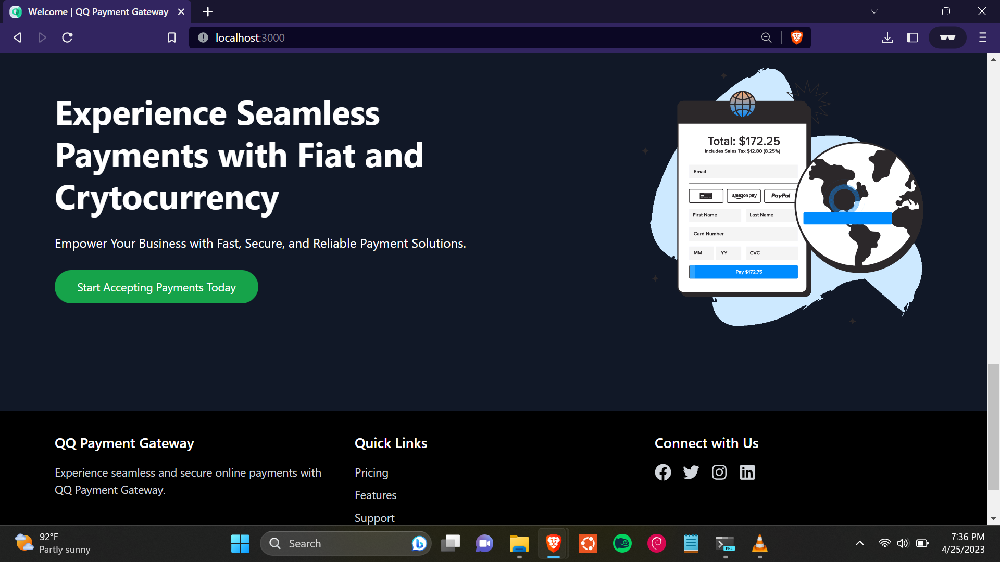
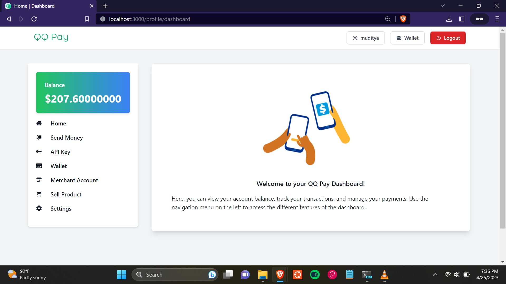

# QQ Payment Gateway

QQ Payment Gateway is an innovative solution that bridges the gap between fiat and cryptocurrencies for small businesses. It streamlines offshore account opening, tackles double spending, and is powered by the lightning-fast Solana Network. Seamlessly integrate with popular e-commerce platforms, access advanced security measures, and enjoy transparent fees.

[](https://www.youtube.com/watch?v=aW69AcN6NV4)


## Table of Contents

- [Features](#features)
- [Installation](#installation)
- [Usage](#usage)
- [Screenshots](#screenshots)
- [Future Updates](#future-updates)
- [Support](#support)
- [License](#license)

## Features

- Double Spending Prevention
- Fiat-Cryptocurrency Compatibility
- Effortless Offshore Account Opening
- Solana Network and Web3 Integration
- Seamless Integration with E-commerce Platforms
- Advanced Security Measures
- Transparent and Competitive Fees
- Real-Time Analytics and Reporting
- 24/7 Customer Support

## Installation

To integrate QQ Payment Gateway into your project, follow these steps:

1. Clone the repository <br>
```
git clone https://github.com/mudityadev/qq-payment-gateway.git
```


2. Install dependencies
```
npm install
```


3. Configure environment variables by creating a `.env` file in the root directory and setting the necessary API keys and credentials.

4. Build the project
```
npm run build
```

5. Start the application
```
npm start
```

## Usage

For detailed usage instructions and integration guides, please refer to our [documentation](https://link-to-documentation).

## Screenshots


*Landing Page*


*Features*


*Footer*


*Dashboard*


*Send Money*


*Transaction Processing*


*Transaction Successful*


*API Keys*


*Create API Key*


*API Key Visible*


*Wallet Information*


*Business Information*


*Setup Store*


*Setting Page*


*Transaction Record*


*Transaction Info*


*Nonce Value (Solves Double Spending Problem)*


*Transaction Details*


*Transaction ID*


*Haldi and Hues Landing Page*


*Haldi and Hues Landing Page*


*Products Coursol*


*Product Page*


*Cart*


*Order Page*


*Checkout Page*


*Payment Form*


*QQ Pay Session*


*Transaction Processing...*


*Transaction Successful*


*Payment Successful Page*


*Card Json Eg.*


## Future Updates

- Support for Additional Cryptocurrencies
- Expanded Offshore Banking Options
- Smart Contracts Integration
- Mobile App for Merchants and Customers
- Integration with Accounting Software
- API for Custom Integrations

## Support

For any questions or issues, please reach out to our support team at support@email.com or visit our [help center](https://link-to-help-center).

## License

This project is licensed under the [MIT License](LICENSE).

